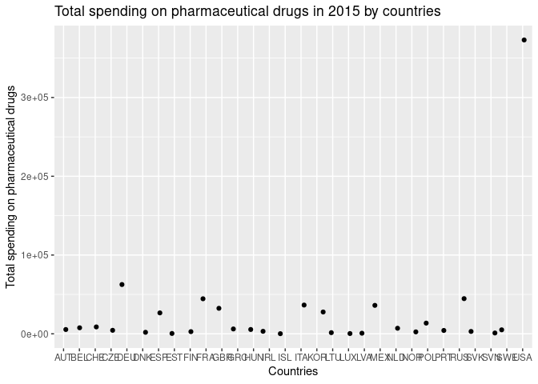

FinalProject
================
Overachievers

``` r
library(tidyverse)
library(broom)
library(countrycode)
```

``` r
happiness <- read_csv("/cloud/project/data/world-happiness/2015.csv")
```

    ## Rows: 158 Columns: 12

    ## ── Column specification ────────────────────────────────────────────────────────
    ## Delimiter: ","
    ## chr  (2): Country, Region
    ## dbl (10): Happiness Rank, Happiness Score, Standard Error, Economy (GDP per ...

    ## 
    ## ℹ Use `spec()` to retrieve the full column specification for this data.
    ## ℹ Specify the column types or set `show_col_types = FALSE` to quiet this message.

``` r
drug_spending <- read_csv("/cloud/project/data/pharmaceutical-drug/pharmaceutical_data_csv.csv")
```

    ## Rows: 1036 Columns: 7

    ## ── Column specification ────────────────────────────────────────────────────────
    ## Delimiter: ","
    ## chr (2): LOCATION, FLAG_CODES
    ## dbl (5): TIME, PC_HEALTHXP, PC_GDP, USD_CAP, TOTAL_SPEND

    ## 
    ## ℹ Use `spec()` to retrieve the full column specification for this data.
    ## ℹ Specify the column types or set `show_col_types = FALSE` to quiet this message.

``` r
drug_spending <- drug_spending %>%
  filter(TIME == 2015) %>%
  mutate(Country = countrycode(LOCATION, "iso3c", "country.name"))
```

``` r
drug_spending %>%
    #filter(TIME == "2015") %>%
    ggplot(aes(x = LOCATION, y = TOTAL_SPEND)) +
    geom_jitter() +
    labs(x = "Countries",
         y = "Total spending on pharmaceutical drugs", 
        title = "Total spending on pharmaceutical drugs in 2015 by countries")
```

<!-- -->
