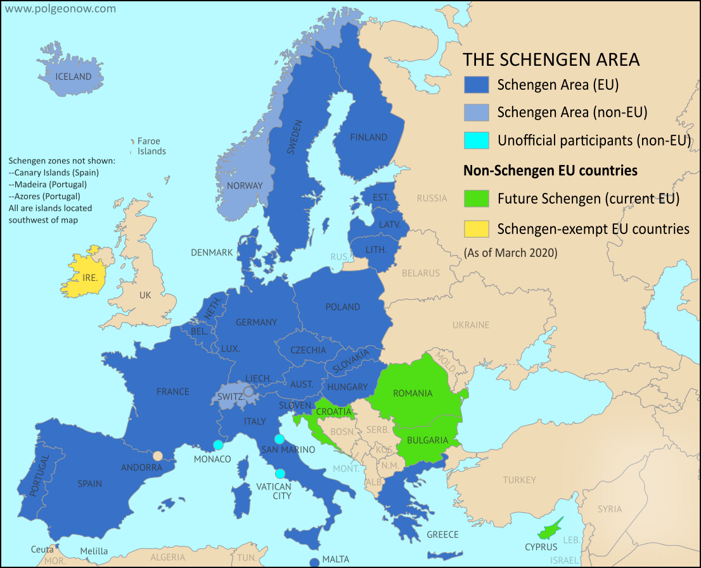

```{r load-packages, include = FALSE}
# Add any additional packages you need to this chunk
library(tidyverse)
library(tidymodels)
library(palmerpenguins)
library(knitr)
library(xaringanthemer)
library(broom)
library(countrycode)
library(RColorBrewer)
library(rgdal)
library(leaflet)
library("sf")
library("raster")
library("sp")
#install.packages("rnaturalearth")
library(rnaturalearth)
#install.packages("plotly")
library(plotly)
library(rgeos)
```

```{r setup, include=FALSE}
# For better figure resolution
knitr::opts_chunk$set(fig.retina = 3, dpi = 300, fig.width = 6, fig.asp = 0.618, out.width = "80%")
```

```{r load-data, include=FALSE}
happiness <- read_csv("/cloud/project/data/world-happiness/2015.csv")
drug_spending <- read_csv("/cloud/project/data/pharmaceutical-drug/pharmaceutical_data_csv.csv")
```

```{r cleaning-data-sets, include=FALSE}
drug_spending <- drug_spending %>%
  filter(TIME == 2015) %>%
  mutate(Country = countrycode(LOCATION, "iso3c", "country.name")) %>%
  mutate(Continent = countrycode(LOCATION, "iso3c", "continent"))
```

```{r cleaning-happiness-dataset, include=FALSE}
happiness$Country_title = str_to_title(happiness$Country)

happiness %>%
  mutate(Continent = countrycode(Country_title, "country.name", "continent"))
```

```{r combine-both-dataset, include=FALSE}
combined <- inner_join(happiness, drug_spending, by = "Country")
```

```{r create-EU-non_EU-vector, include=FALSE}

x <- c("non-EU", "non-EU", "EU", "non-EU", "EU", "EU", "EU", "EU", "Outside-Europe", "Outside-Europe", "EU", "EU", "EU", "Outside-Europe", "EU", "EU", "EU", "EU", "Outside-Europe", "EU", "EU", "EU", "EU", "non-EU", "EU", "EU", "EU", "EU", "EU")
```


```{r adding-new-column-of-EU-nonEU, include=FALSE}
combined$NonEU_EU <- x
```

```{r filtering-data-to-European-Countries, include=FALSE}
european_combined <- combined %>%
  filter(NonEU_EU != "Outside-Europe")
```

```{r linear-regresssion-PC-GDP-Happiness-Score, include=FALSE}
gdp_happiness_correlation <- 
  linear_reg() %>%
  set_engine("lm") %>%
  fit(`Happiness Score` ~ PC_GDP + factor(NonEU_EU), data = european_combined)
```

```{r include=FALSE}
augmented_fit_lm <- augment(gdp_happiness_correlation$fit)

finaldf <- cbind(european_combined$Country, augmented_fit_lm )

```

```{r rename-country-column, include=FALSE}
finaldf <- rename(finaldf, Country = `european_combined$Country`)
```


```{r add-geometry-to-df, include=FALSE}
europe <- ne_countries(continent = 'europe', returnclass="sf")
europe_map_df<- full_join(finaldf, europe, by = c("Country" = "name"))
```

background-image: url(../presentation/img/true_happiness.png)
background-position: top right
background-size: contain
class: middle, left

```{r title-slide-settings, include = FALSE}
style_xaringan(
  title_slide_background_image = "../presentation/img/true_happiness.png",
  title_slide_text_color = "#000"
)
```

```{r western-level, include = FALSE}
happy2015 <- happiness %>%
     mutate(western_level = case_when(Region %in% "Australia and New Zealand" ~ "Western",
                                     Region %in% "Central and Eastern Europe" ~ "Western",
                                     Region %in% "Eastern Asia" ~ "Non-Western",                                        Region %in% "Latin America and Caribbean" ~ "Western",
                                     Region %in% "Middle East and Northern Africa" ~ "Non-Western",
                                     Region %in% "North America" ~ "Western",
                                     Region %in% "Southeastern Asia" ~ "Non-Western",
                                     Region %in% "Southern Asia" ~ "Non-Western",
                                     Region %in% "Sub-Saharan Africa" ~ "Non-Western",
                                     Region %in% "Western Europe" ~ "Western",
) )
```


```{r filter-western, include=FALSE}
western_countries <- filter(happy2015, western_level == "Western")
western_countries
nonwestern_countries <- filter(happy2015, western_level =="Non-Western")
nonwestern_countries
```

```{r filter-AllEU, include=FALSE}
AllEUcountries <- 
western_countries %>%
filter( Region %in% c("Central and Eastern Europe","Western Europe"))
AllEUcountries
```

```{r EU-status, include=FALSE}
AllEUcountries <- AllEUcountries %>%
     mutate(EU_status = case_when(Country %in% "Austria" ~ "EU",
                                     Country %in% "Belgium" ~ "EU",
                                     Country %in% "Bulgaria" ~ "EU",
                                     Country %in% "Croatia" ~ "EU",
                                     Country %in% "Cyprus" ~ "EU",
                                     Country %in% "Czech Republic" ~ "EU",
                                     Country %in% "Denmark" ~ "EU",
                                     Country %in% "Estonia" ~ "EU",      
                                     Country %in% "Finland" ~ "EU",   
                                     Country %in% "France" ~ "EU",            
                                     Country %in% "Germany" ~ "EU",       
                                     Country %in% "Greece" ~ "EU",                                                    Country %in% "Hungary" ~ "EU",
                                     Country %in% "Ireland" ~ "EU",   
                                     Country %in% "Italy" ~ "EU",    
                                     Country %in% "Latvia" ~ "EU",                                                    Country %in% "Lithuania" ~ "EU", 
                                     Country %in% "Luxembourg" ~ "EU", 
                                     Country %in% "Malta" ~ "EU",  
                                     Country %in% "Netherlands" ~ "EU",   
                                     Country %in% "Poland" ~ "EU",       
                                     Country %in% "Portugal" ~ "EU",  
                                     Country %in% "Romania" ~ "EU",     
                                     Country %in% "Slovakia" ~ "EU",  
                                     Country %in% "Slovenia" ~ "EU",                                                  Country %in% "Spain" ~ "EU",     
                                     Country %in% "Sweden" ~ "EU",   
                                     TRUE ~ "Non-EU"
) )
```

```{r filter-EU, include=FALSE}
CountriesEU <- filter(AllEUcountries, EU_status == "EU")
CountriesEU 
NonEUcountries <- filter(AllEUcountries, EU_status =="Non-EU")
NonEUcountries
```


class: center, middle

## Goal 
### We seek to find correlations between countries' Happiness scores and specific factors such as family, percent GDP and healthcare spending on pharmaceutical drugs.

???
- We sought to find correlations between countries' Happiness scores and specific factors such as family, percent GDP and healthcare spending on pharmaceutical drugs. 

---

class: left, middle

# Background

* Two pieces of information we are interested in: 

  * World Happiness Report, a measurement of state of global happiness 
  
  * Pharmaceutical drug spending, a potential contributing factor a nation’s happiness score
  
  * Both were pulled from kaggle.com

```{r, echo=FALSE, out.width="100%", fig.align='left'}


```

```{r, echo=FALSE, out.width="100%", fig.align='right'}


```


???
- The World Happiness Report measures the state of global happiness using a survey where respondents rate their own lives based on different factors and was availible at kaggle.com. This includes family, freedom, health, economy and trust towards the government. This report is important because since it first came out in 2012, it gained global recognition from governments, organizations and civil society and has been administered every year since. The measurements of well-being could potentially be used to assess the progress of a nation, informing their  policy-making decisions from happiness indicators measured in the report. 
- In addition, we are interested in taking in other factors that could possibly contribute to the happiness score outside the indicators that the world happiness report currently collects. We found a dataset (from kaggle.com) on the pharmaceutical drug spending by countries with respect to the GDP and the total healthcare spending in a specific year. We are intersted in the potential relationships between pharmecuitical spending and the happiness report data. 

---

class: center, middle

# Hypotheses 

* Non-western countries have higher family importance scores influencing happiness scores.

* The higher the percent of drug spending on GDP, the higher the percent spent on pharmaceutical drugs in healthcare.

* The higher the percent GDP spending on pharmaceuticals, the lower the happiness score of European countries.


???
- research has shown that non-western countries have higher collectivism values than western countries that tend to be more individualistic, thus, we hypothesize that non-western countries have higher family importance scores influencing happiness scores.

---

class: left, middle

### Family Effect on Happiness Scores for Western Countries

.pull-left[
* We ran a linear regression to see the potential relationship between the Family variable and Happiness Scores for western countries. 

* The linear regression line found was: 
Happiness score = 2.347 + 3.259(family)

* The adjusted r-squared was 0.45 meaning that 45% of the variance of the happiness scores were explained by the variance of the Family variable. 
]

.pull-right[
```{r plotting-linear-regression-line, echo= FALSE, out.width = "100%"}
ggplot(western_countries, aes(x = `Happiness Score`, y = Family)) +
  geom_jitter(color = "blue") +
  geom_smooth(method = "lm", 
              color = "orange", 
              se = FALSE) +
  labs(title = "Family and Happiness Score for Western Countries ",
       x = "Happiness Score",
       y = "Family")

western_countries_lr <- 
  linear_reg() %>%
  set_engine("lm") %>%
  fit(`Happiness Score` ~ Family, data = western_countries) 
```
]

---

class: left, middle

### Family Effect on Happiness Scores for Non-Western Countries

.pull-left[
* Similarly, we ran a linear regression to see the potential relationship between the Family variable and Happiness Scores for non-western countries. 

* The linear regression line found was: 
Happiness score = 2.819 + 2.257(family)

* The adjusted r-squared was 0.39 meaning that 39% of the variance of the happiness scores were explained by the variance of the Family variable. 

*This refutes our hypothesis. 
]

.pull-right[
```{r plotting-linear-regression-nonwestern, echo = FALSE, out.width = "100%"} 
ggplot(nonwestern_countries, aes(x = `Happiness Score`, y = Family)) +
  geom_jitter(color = "blue") + 
  geom_smooth(method = "lm", 
              color = "orange", 
              se = FALSE) +
  labs(title = "Family and Happiness Score for Non-Western Countries ",
       x = "Happiness Score",
       y = "Family")

nonwestern_countries_lr <- 
  linear_reg() %>%
  set_engine("lm") %>%
  fit(`Happiness Score` ~ Family, data = nonwestern_countries) 
```
]

---

class: left, left

### Relationship Between Family and Happiness Score for EU Countries

.pull-left[
* We then looked into a linear regression to see the potential relationship between the Family variable and Happiness Scores for European countries. We broke it down into 2 parts: EU countries and non-EU countries. 

* The linear regression line for EU countries found was: 
Happiness score = 2.451 + 2.299(family)

* The adjusted r-squared was 0.68 meaning that 68% of the variance of the happiness scores were explained by the variance of the Family variable.
]

.pull-right[
```{r plotting-linear-regression-EU, echo = FALSE, out.width = "100%"}
ggplot(CountriesEU, aes(x = `Happiness Score`, y = Family)) +
  geom_jitter(color = "blue") +
  geom_smooth(method = "lm", 
              color = "orange", 
              se = FALSE) +
  labs(title = "Family and Happiness Score for EU countries ",
       x = "Happiness Score",
       y = "Family")

CountriesEU_lr <- 
  linear_reg() %>%
  set_engine("lm") %>%
  fit(`Happiness Score` ~ Family, data = CountriesEU) 
```
]

---

### Relationship Between Family and Happiness Score for Non-EU Countries

.pull-left[
* We performed the same analysis for European countries which are not part of the EU.

* The linear regression line for these countries found was found to be the same as EU countries: 
Happiness score = 2.451 + 2.299(family)

* This did not add to our hypothesis. 
]

.pull-right[
```{r plotting-linear-regression-nonEU, echo = FALSE, out.width = "100%"}
ggplot(NonEUcountries, aes(x = `Happiness Score`, y = Family)) +
  geom_jitter(color = "blue") +
  geom_smooth(method = "lm", 
              color = "orange", 
              se = FALSE) +
  labs(title = "Family and Happiness Score for Non-EU Countries ",
       x = "Happiness Score",
       y = "Family")

NonEUcountries_lr <- 
  linear_reg() %>%
  set_engine("lm") %>%
  fit(`Happiness Score` ~ Family, data = NonEUcountries) 
```
]

---

class: left, left

### The higher the percent of drug spending on GDP, the higher the percent spent on pharmaceutical drugs in healthcare

```{r finding-GDP-healthXP-in-Europe-2015, echo=FALSE}
drug_spending %>%
    filter(Continent == "Europe") %>%
    ggplot(aes(x = PC_GDP, y = PC_HEALTHXP, colour = Country)) +
    geom_point() +
    geom_smooth(method = "lm", 
              color = "black",
              size = 0.3,
              se = FALSE) +
    labs(x = "Percent of Drug Spending on GDP",
         y = "Percent of Drug Spending on Total Healthcare Spending", 
        title = "Pharmaceutical Drug Spending As A Share of Total Healthcare Spending & GDP",
        subtitle = "in European Countries")
```

---

class: left, middle

### Percent GDP (Pharmaceutical Spending) on Countries' Happiness Scores

```{r linear-regresssion-PC_GDP-Happiness-Score, include = FALSE}
gdp_happiness <- 
  linear_reg() %>%
  set_engine("lm") %>%
  fit(`Happiness Score` ~ PC_GDP, data = european_combined)
gdp_happiness
```

```{r squared-of-correlation-interaction, include = FALSE}
glance(gdp_happiness)$adj.r.squared
```

.pull-left[
```{r plotting-with-line-of-best-fit, echo = FALSE, out.width = "100%"}
european_combined %>%
    ggplot(aes(x = PC_GDP, y = `Happiness Score`, color = NonEU_EU)) +
    geom_point() +
    geom_smooth(method = "lm", 
              color = "yellow", 
              se = FALSE) + 
    labs(title = "Pharmeceutical Spending Percent of GDP and Happiness Scores", 
         x = "Percent of GDP",
         y = "Happiness Score", 
         color = "EU vs. Non-EU Countries")
```
]

.pull-right[
* We ran a linear regression to see the potential relationship between percent of GPD (spending on pharmaceuticals) and Happiness Scores. 

* The linear regression line found was: 
happiness score = 8.368 - 1.423(Percent GDP)

* The adjusted r-squared was 0.38 meaning that 38% of the variance of the happiness scores were explained by the variance of the percent spending of GDP. 

* This at least shows preliminary evidence for accepting our hypothesis that the higher the percent GDP spending on pharmaceuticals, the lower the happiness score of European countries.
]


--- 
---
class: left, middle

# Implication

.pull-left[
```{r plotting-residuals, echo=FALSE, warning=FALSE, out.height="30%", out.width="100%"}
fit <- lm(`Happiness Score` ~ PC_GDP, data = european_combined) # fit the model
european_combined$predicted <- predict(fit)   # Save the predicted values
european_combined$residuals <- residuals(fit) # Save the residual values
          
ggplot(european_combined, aes(x = PC_GDP, y = `Happiness Score`)) +
  # regression line
  geom_smooth(method = "lm", se = FALSE, color = "lightgrey") +   
  # draw line from point to line  
  geom_segment(aes(xend = PC_GDP, yend = predicted), alpha = .2) +
  # size of the points
  geom_point(aes(color = abs(residuals), size = abs(residuals))) +
  # colour of the points mapped to residual size - green smaller, red larger
  scale_color_continuous(low = "green", high = "red") +
  # Size legend removed
  guides(color = FALSE, size = FALSE) +                           
  geom_point(aes(y = predicted), shape = 1) +
  theme_bw() + 
  labs(x = "Percent of Drug Spending as a Share of GDP",
       y = "Happiness Score", 
       title = "The Residual Plot for Happiness Score vs. 
                Percent Drug Spending as a Share of GDP")

### Code sourced from https://www.statology.org/residual-plot-r/
```
]

.pull-right[
```{r europe-map, echo=FALSE, warning=FALSE, out.height="30%", out.width="100%"}
map <- ggplot(europe_map_df) +
  geom_sf(aes(fill = .std.resid, geometry = europe_map_df$geometry)) +
  labs(title = "Happiness Score vs. Residual Values in Europe",
       x = "Longitude",
       y = "Latitude", 
       fill = "Residual Values") +
  xlim(-40, 50) +
  ylim(20, 85) +
  scale_fill_distiller(palette = "Spectral", na.value = "white")

ggplotly(map)
```
]

???
The greater our residual value, the greater the size of the point. The size of the point and the length of the vertical line from the regression line to the point are correlated. Green indicates a smaller residual value while red represents a much higher residual value. 

---

class: left, middle

#Implication

.pull-left[
```{r, echo=FALSE, out.width=1050, fig.align='center', fig.cap="A map of Europe containing the schengen countries, EU and non-EU countries"}



```
]

.pull-right[
```{r europe-map-2, echo=FALSE, warning=FALSE, out.height="30%", out.width="100%"}
map <- ggplot(europe_map_df) +
  geom_sf(aes(fill = .std.resid, geometry = europe_map_df$geometry)) +
  labs(title = "Happiness Score vs. Residual Values in Europe",
       x = "Longitude",
       y = "Latitude", 
       fill = "Residual Values") +
  xlim(-40, 50) +
  ylim(20, 85) +
  scale_fill_distiller(palette = "Spectral", na.value = "white")

ggplotly(map)
```
]

???
Switzerland that is not in the EU has a much higher happiness score than what is expected. The other western european countries seem to also have a higher normalized residual score compared to other European regions. It seems that Northern Europe tends to have a lower normalized residual scores, along with Eastern Europe. 

---

class: left, middle

# Limitations and Future Study  

* The merged data set is not a full representation of the world (as there were many countries missing from most continents besides Europe). 
* Happiness is such a hard variable to measure, therefore it is hard to conclude how much GDP spending on pharmaceuticals impacted Happiness Scores
* Correlation does not equal causation. 

